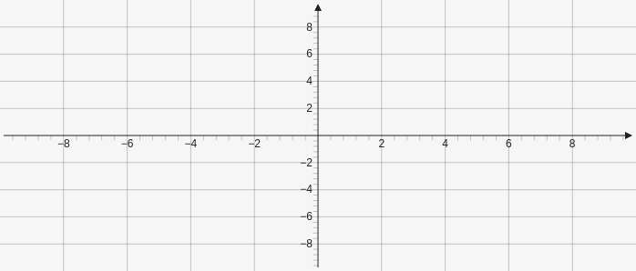
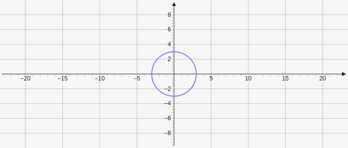
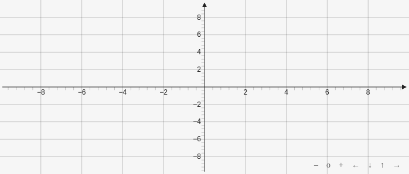

# Board

The board is the graph base which all the elements get to applied to. The board can be customized with various attributes.

## Bounds

The bounds controls the initial size of the graph it is defined through four numbers in an array `[xMin, yMax, xMax, yMin]`

````yaml
```graph
bounds: [-10, 10, 10, -10]
```
````



## DefaultAxes

This allows you to customize how the axis behaves and looks there are a lot of different attributes that can be applied here. The x and y axis are defined seperately.
````yaml
```graph
bounds: [-10, 10, 10, -10]
defaultAxes: {
	x: {
	
	},
	y: {
	
	}
}
```
````

### Anchor

Used when position is set to fixed or sticky to define where the axis should go. 

* `left`
* `right`
* `right left`

### AnchorDist

A distance offset from the edge when using the anchor attribute.

* number which is the amount of coordinate positions to offset
* string with the `'px'` unit to give a pixel offset
* string with the `'%'` unit to give a ratio based on the height or width of the board

### Position

Is used to define how the axis behaves when moving around the graph.

* `static`: the standard behavior
* `fixed`: the axis is placed in a fixed position based on the anchor attribute to position the axis to the right or left edge of the graph
* `sticky`: a combination of static and fixed that puts the axis in the standard position but will stay visible when moving around the graph

## Keep Aspect Ratio

`keepAspectRatio` when set to true makes it so that the scale of both axis will always be the same. This is good when graphing a circle and wanting it to actually appear like a circle.

````yaml
```graph
bounds: [-10, 10, 10, -10]
keepAspectRatio: true
elements: [
	{type: circle, def: [[0,0], 3]}
]
```
````



## Drag

Elements on the graph can be moved around and interacted with. If drag is set to false than they can no longer be moved around.

````yaml
```graph
bounds: [-10, 10, 10, -10]
drag: false
```
````

## Label

Anything that can be customized on a label can be customized on a graph label along with a new `toFraction` which will give the axis values as fraction instead of decimals when set to true.

````yaml
```graph
bounds: [-1, 1, 1, -1]
defaultAxes: {
	x: {
		ticks: {
			label: {
				toFraction: true
			}
		}
	},
	y: {
	
	}
}
```
````

## MaxBoundingBox

The bounding box is the initial view of the graph. MaxBoundingBox allows you to set a max view area so that it cannot be infinite.

````yaml
```graph
bounds: [-10, 10, 10, -10]
maxBoundingBox: [-20, 20, 20, -20]
```
````

## Navigation

At the bottom right of the graph there is navigation to move within the graph. By default navigation is on but can be disabled with `showNavigation: false`

* \+
	* zoom in
* O 
	* reset zoom and position
* \-
	* zoom out
* $\leftarrow$
	* move left
* $\downarrow$
	* move down
* $\uparrow$
	* move up
* $\rightarrow$
	* move right
	
With navigation

````yaml
```graph
bounds: [-10, 10, 10, -10]
```
````



Without navigation

````yaml
```graph
bounds: [-10, 10, 10, -10]
showNavigation: false
```
````


## Axis

You can disable showing the axis and the grid line by setting `axis: false`,

````yaml
```graph
bounds: [-10, 10, 10, -10]
axis: false
```
````

## Height

You can set the height of the board in pixels `height: number`.

````yaml
```graph
bounds: [-10, 10, 10, -10]
height: 400
```
````

## Width

You can set the width of the board in pixels `width: number`.

````yaml
```graph
bounds: [-10, 10, 10, -10]
width: 400
```
````
