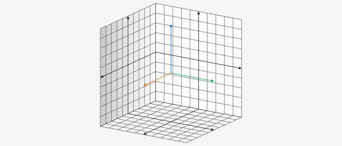
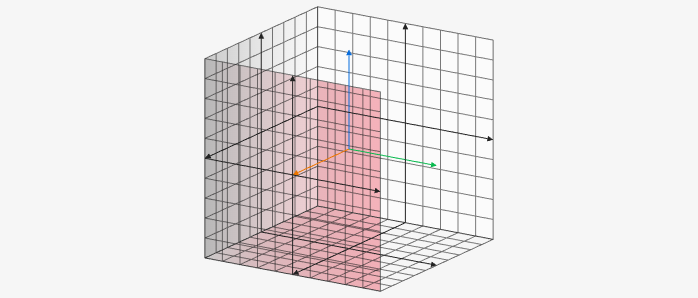
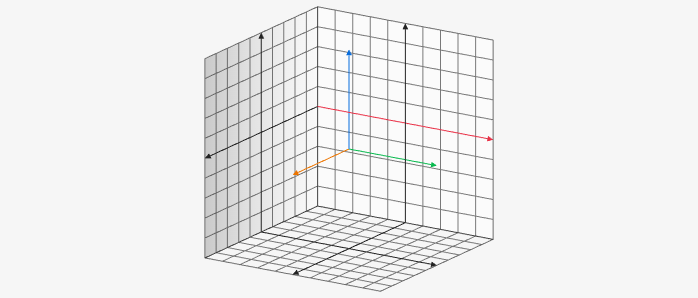

# Board3D

To use 3D elements you need to create a 3D board which is done by setting the `bounds3d` attribute on the board. I also recommend setting `axis: false` and `keepAspectRatio: true`.

````yaml
```graph
bounds: [-10, 10, 10, -10]
bounds3d: [[-5,5], [-5,5], [-5,5]]
axis: false
keepAspectRatio: true
```
````



You can also use the `graph3d` codeblock to provide better defaults for 3D graphs which can be overridden.
These defaults are
* `bounds: [-10, 10, 10, -10]`
* `bounds3d: [[-5,5], [-5,5], [-5,5]]`
* `axis: false`
* `keepAspectRatio: true`

````yaml
```graph3d
elements: []
```
````


## Attributes

 There are custom attributes as well as the normal ones for the 3D board. To change the attributes of the 3D board you use `att3d`.

````yaml
```graph3d
att3d:
```
````


### axesPosition

This controls the axes arrows that by default are seen at the the center. 
There are three options:
1. `center`
	* default
3. `none`
	* no axes are visible


### projection

Changes how the graph is viewed with two options:
1. `parallel` 
	* this is parallel (orthographic) projection
2. `central`
	* this is central (perspective) projection

### trackball

Changes how the mouse movement effects the view to use a virtual trackball.

`trackball: {enabled: true}`

### axis

You can change the attributes on the axis objects by using `xAxis`, `yAxis`, or `zAxis`. With these you can change the normal attributes like `strokeColor`, `strokeWidth`, etc.

### plane

You can change the attributes of the planes seen in the on the 3D board `xPlaneRear`, `yPlaneRear`, `zPlaneRear`. There are also `xPlaneFront`, `yPlaneFront`, `zPlaneFront` these by default are not visible.

````yaml
```graph3d
att3d:
  xPlaneFront: {visible: true, fillColor: red}
```
````



### planeAxis

You can change the attributes on the board planes' axes by using:
* `xPlaneFrontYAxis`
* `xPlaneFrontZAxis`
* `xPlaneRearYAxis`
* `xPlaneRearZAxis`
* `yPlaneFrontXAxis`
* `yPlaneFrontZAxis`
* `yPlaneRearXAxis`
* `yPlaneRearZAxis`
* `zPlaneFrontXAxis`
* `zPlaneFrontYAxis`
* `zPlaneRearXAxis`
* `zPlaneRearYAxis`

````yaml
```graph3d
att3d:
  xPlaneRearYAxis: {strokeColor: red}
```
````

