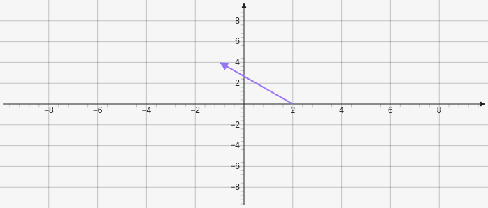

# Arrow 

Arrow creates an arrow on the graph it takes two points with the second point being where the arrow head is pointing `[[x,y], [x,y]]`.

````yaml
```graph
bounds: [-10, 10, 10, -10]
elements: [
	{type: arrow, def: [[2,0], [-1,4]]}
]
```
````


