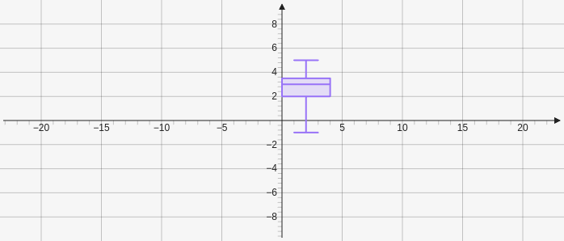

# Boxplot

Creates a boxplot which takes an array containing at least 5 quantiles and then a number for the axis position and a number for the width `[[quantiles], axis, width]`.

````yaml
```graph
bounds: [-10, 10, 10, -10]
keepAspectRatio: true
elements: [
	{type: boxplot, def: [[-1, 2, 3, 3.5, 5], 2, 4]}
]
```
````


