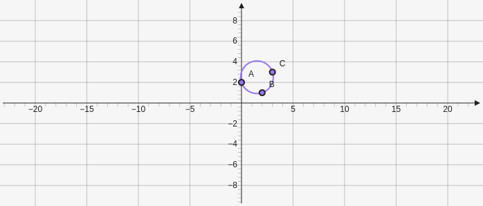

# Circumcenter

Creates a point at the midpoint of three points. Takes three points for the parameters `[[x,y],[x,y],[x,y]]`

````yaml
```graph
bounds: [-10, 10, 10, -10]
keepAspectRatio: true
elements: [
	{type: circumcenter, def: [[0,2], [2,1], [3,3]]}
]
```
````



