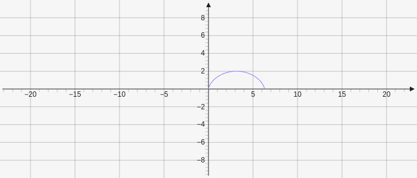
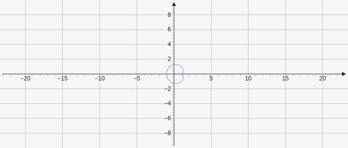
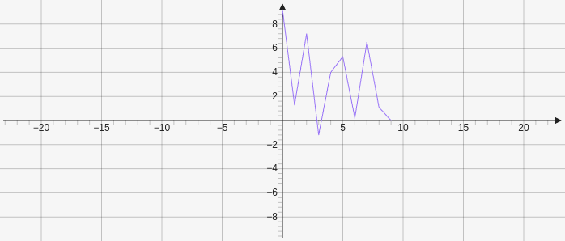

# Curve

Creates a curve which can make parametric curve, polar curves, or data plots. 

## Parametric

The first parameter is a number or function that describes the x-coordinate. The second parameter is a number of function that describes the y-coordinate. The third and fourth parameter are optional and define the left and right interval borders for the curve.

````yaml
```graph
bounds: [-10, 10, 10, -10]
keepAspectRatio: true
elements: [
	{type: curve, def: ["f:x-sin(x)", "f:1-cos(x)", 0, "f:2*PI"]}
]
```
````



## Polar

The first parameter is a function in terms of phi (use x as variable). The second parameter is the offset of the curve and has to be an array containing numbers. The third and fourth parameters describe the left and right interval border.

````yaml
```graph
bounds: [-10, 10, 10, -10]
keepAspectRatio: true
elements: [
	{type: curve, def: ["f:1-cos(x)", [1,0], 0, "f:2*PI"]}
]
```
````



## Data Plots

The first parameter is an array of the x values and the second parameter is an array of the y values.

````yaml
```graph
bounds: [-10, 10, 10, -10]
keepAspectRatio: true
elements: [
	{type: curve, def: [[0,1,2,3,4,5,6,7,8,9],[9.2,1.3,7.2,-1.2,4.0,5.3,0.2,6.5,1.1,0.0]]}
]
```
````


