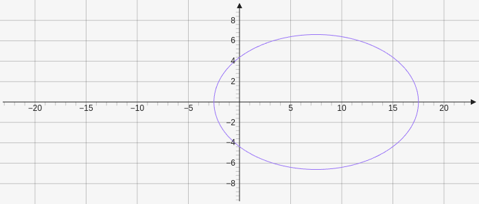

# Ellipse

Ellipse creates an ellipse which takes two x,y points and a number for the length of the major axis `[[x,y], [x,y], length]`.

````yaml
```graph
bounds: [-10, 10, 10, -10]
keepAspectRatio: true
elements: [
	{type: ellipse, def: [[0,0], [15,0], 20]}
]
```
````



