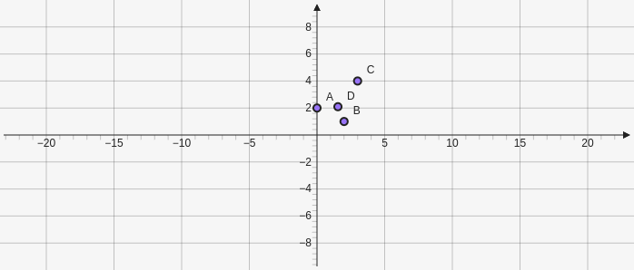

# Incenter

Creates the incenter of a triangle from the three points taken as parameters `[[x,y],[x,y],[x,y]]`.

````yaml
```graph
bounds: [-10, 10, 10, -10]
keepAspectRatio: true
elements: [
	{type: incenter, def: [[0,2], [2,1], [3,4]]}
]
```
````


