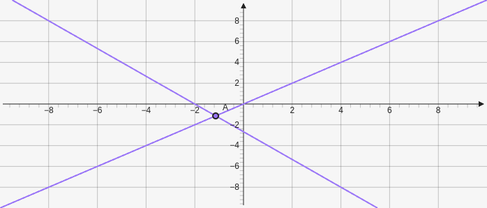

# Intersection

Intersection displays a point where to graph elements intersect. It takes in two elements as parameters to use `["e", "e"]`. 

````yaml
```graph
bounds: [-10, 10, 10, -10]
elements: [
	{type: line, def: [[0,0], [1,1]]},
	{type: line, def: [[-2,0], [1,-4]]},
	{type: intersection, def: ["e0", "e1"]}
]
```
````



