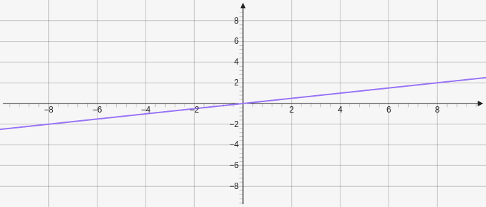

# Line

Lines are created by defining a line with two points. It takes two points as parameters `[[x,y], [x,y]]`.

````yaml
```graph
bounds: [-10, 10, 10, -10]
elements: [
	{type: line, def: [[0,0],[4,1]]}
]
```
````



