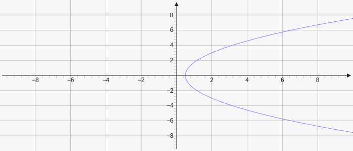

# Parabola

Parabola creates a parabola on the graph and takes a point for the focus and a line for the directrix `[[x,y], [[x,y],[x,y]]]`.

````yaml
```graph
bounds: [-10, 10, 10, -10]
elements: [
	{type: parabola, def: [[2,0], [[-1,4], [-1,-4]]]}
]
```
````



