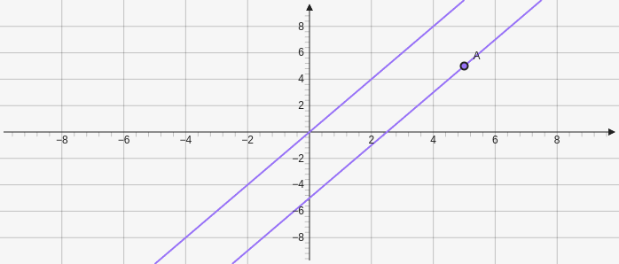

# Parallel

Creates a line parallel to a line and goes through a point. Takes in a line for the first parameter and a point for the second `["e", [x,y]]`.

````yaml
```graph
bounds: [-10, 10, 10, -10]
elements: [
	{type: line, def: [[1,2], [2,4]]},
	{type: parallel, def: ["e0", [5,5]]}
]
```
````



