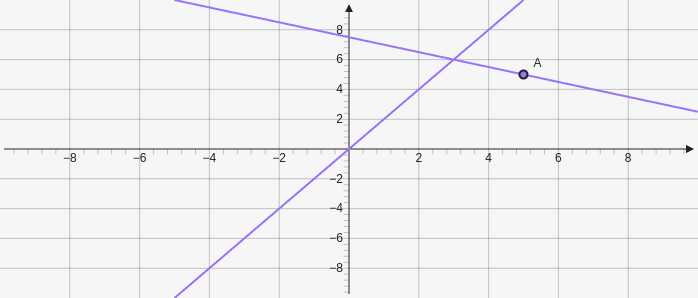

# Perpendicular

Creates a line that is perpendicular to a line and goes through a point. Takes in a line for the first parameter which can be defined there or an existing element and then a point which can be defined or an existing element `["e", [x,y]]`. 

````yaml
```graph
bounds: [-10, 10, 10, -10]
elements: [
	{type: line, def: [[1,2],[2,4]]},
	{type: perpendicular, def: ["e0",[5,5]]}
]
```
````



