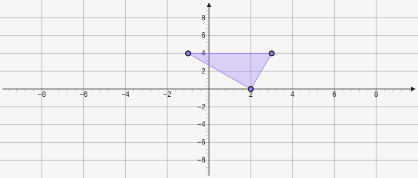

# Polygon

Polygon creates a polygon on the graph it takes in as many points as you give it `[[x,y], [x,y], ...]`.

````yaml
```graph
bounds: [-10, 10, 10, -10]
elements: [
	{type: polygon, def: [[2,0], [-1,4], [3,4]]}
]
```
````



To change the attributes of the points of a polygon you need to use the `vertices` object.
To change the attributes of the lines of a polygon you need to use the `borders` object.

````yaml
```graph
bounds: [-10, 10, 10, -10]
elements: [
	{type: polygon, def: [[2,0], [-1,4], [3,4]], att: {vertices: {strokeColor: red}, borders: {strokeColor: red}}}
]
```
`````


