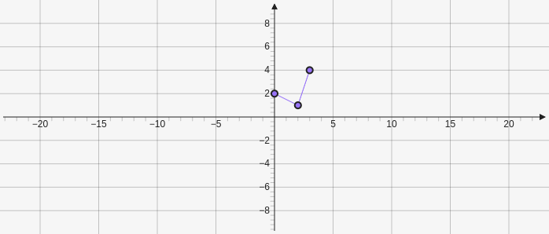

# Polygonalchain

Creates connected series of lines from an array of points `[[x,y],[x,y],...]`

````yaml
```graph
bounds: [-10, 10, 10, -10]
keepAspectRatio: true
elements: [
	{type: polygonalchain, def: [[0,2], [2,1], [3,4]]}
]
```
````



