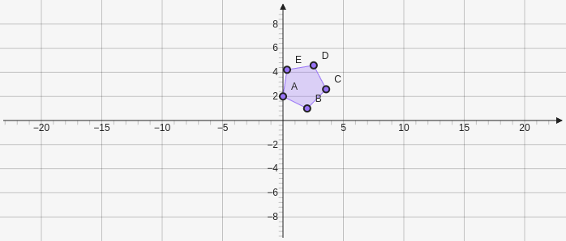

# RegularPolygon

Creates a regular polygon which takes two points the defines the baseline and a number defines the number of vertices `[[x,y],[x,y], vertices]`.

````yaml
```graph
bounds: [-10, 10, 10, -10]
keepAspectRatio: true
elements: [
	{type: regularpolygon, def: [[0,2],[2,1], 5]}
]
```
````



