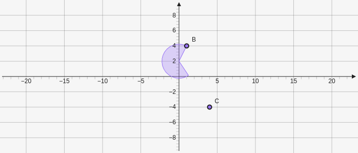

# Sector

Creates a sector based on three points. Takes three points as parameter `[[x,y],[x,y],[x,y]]`.

````yaml
```graph
bounds: [-10, 10, 10, -10]
keepAspectRatio: true
elements: [
	{type: sector, def: [[0,2],[1,4],[4,-4]]}
]
```
````



