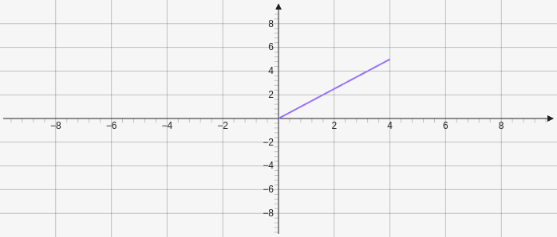

# Segment

Creates a segment which is a line with two end points. Takes two points as parameters and also has a third optional fixed length parameter which is a number `[[x,y],[x,y], length]`.

````yaml
```graph
bounds: [-10, 10, 10, -10]
elements: [
	{type: segment, def: [[0,0], [4,5]]}
]
```
````



