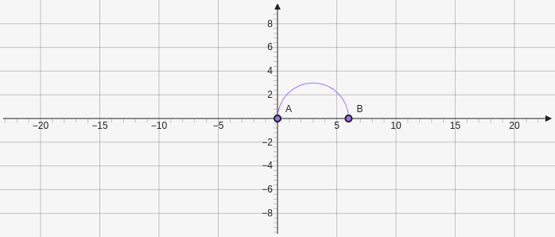

# Semicircle

Semicircle creates a semicircle which takes two points and makes and ark between them `[[x,y], [x,y]]`.

````yaml
```graph
bounds: [-10, 10, 10, -10]
keepAspectRatio: true
elements: [
	{type: semicircle, def: [[0, 0],[6,0]]}
]
```
````



