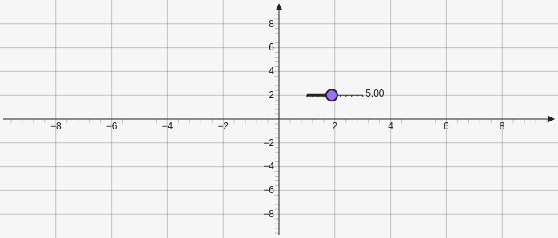

# Slider

Creates a slider that you can use to change values of elements. It takes two points for where to put the slider and then an array that holds the range of the slider and the starting point `[[x,y],[x,y],[min,start,max]]`

````yaml
```graph
bounds: [-10, 10, 10, -10]
elements: [
	{type: slider, def: [[1,2], [3,2], [1,5,10]]}
]
```
````



