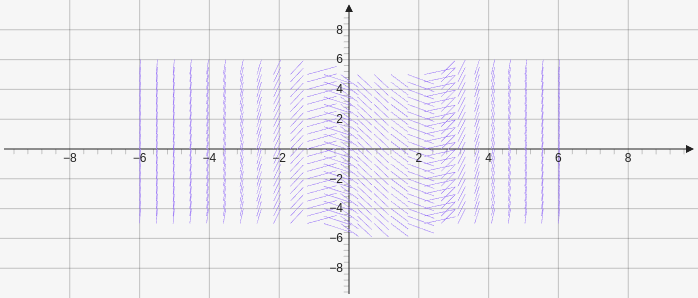

# Slopefield

Creates a slope field which takes in a function and a xData and yData array. The arrays contain the start, steps, and end values `["f:", [xStart, xSteps, xEnd], [yStart, ySteps, yEnd]]`.

````yaml
```graph
bounds: [-10, 10, 10, -10]
elements: [
	{type: slopefield, def: ["f:x*x-x-2", [-6,25,6], [-5,20,5]]}
]
```
````



