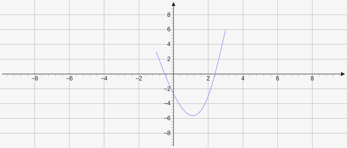
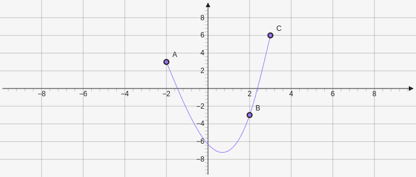

# Spline

Creates a cubic spline curve. It takes an array x values and then y values`[[x1,x2,x3,...],[y1,y2,y3,...]]`. It can also take an array of point elements `["e1", "e2",...]`.


````yaml
```graph
bounds: [-10, 10, 10, -10]
elements: [
{type: spline, def: [[-1,2,3], [3,-3,6]]}
]
```
````




````yaml
```graph
bounds: [-10, 10, 10, -10]
elements: [
{type: point, def: [-2, 3]},
{type: point, def: [2, -3]},
{type: point, def: [3, 6]},
{type: spline, def: ["e0", "e1", "e2"]}
]
````




