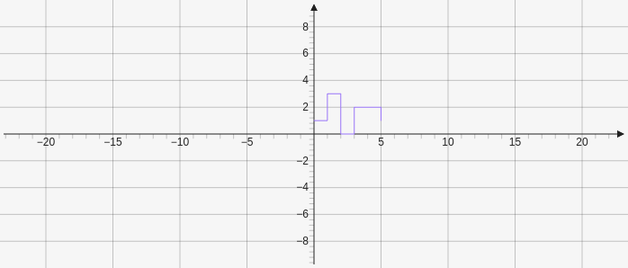

# Stepfunction

Creates a step function which takes two arrays the first one for x values and the second for y values `[[x values], [y values]]`.

````yaml
```graph
bounds: [-10, 10, 10, -10]
keepAspectRatio: true
elements: [
	{type: stepfunction, def: [[0,1,2,3,4,5], [1,3,0,2,2,1]]}
]
```
````



