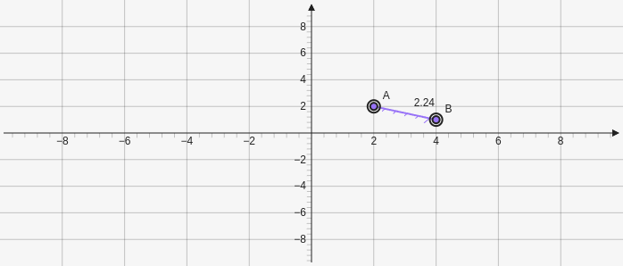

# TapeMeasure

Creates a tape measure that can be used to measure the distance between points. Takes two points which are the starting position as parameters `[[x,y],[x,y]]`.

````yaml
```graph
bounds: [-10, 10, 10, -10]
elements: [
	{type: point, def: [2,2]},
	{type: point, def: [4,1]},
	{type: tapemeasure, def: [[2,2], [4,1]]},
]
```
````



