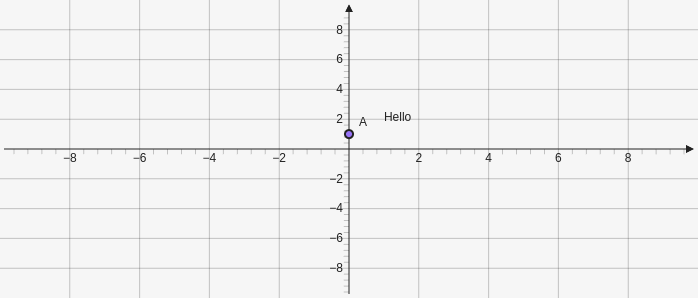

# Text
Create a text object. Takes an x and y position as parameters and a string [x,y, "string"]. You can anchor a text object to another element by putting `anchor: "e"` in the `att`.

You can use LaTeX in your text by wrapping text in `$` to do inline math. To use LaTeX commands you also need to use two back slashes instead of one for example `"$\\vec{v}$"`.

````yaml
```graph
bounds: [-10,10,10,-10]
elements: [
	{type: point, def: [0,1]},
	{type: text, def: [1,1, "Hello"], att: {anchor: "e0"}}
]
```
````



