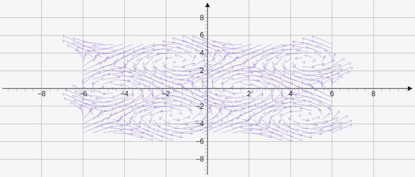

# Vectorfield

Create a vector field that takes in an array of two functions and then an xData and yData array. These arrays contain three values start, steps, and end `[["f:","f:"], [xStart, xSteps, xEnd], [yStart, ySteps, yEnd]]`

````yaml
```graph
bounds: [-10, 10, 10, -10]
elements: [
	{type: vectorfield, def: [["f:sin(y)", "f:cos(x)"], [-6,25,6], [-5,20,5]]}
]
```
````



