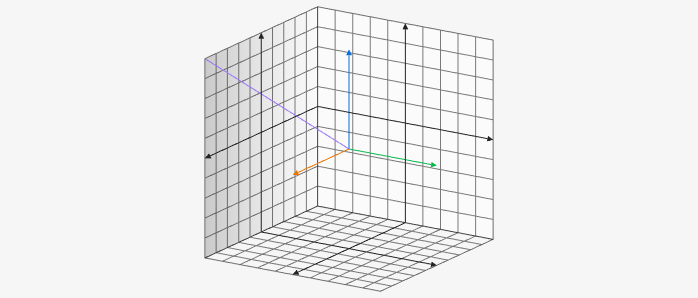

# Curve3D

Curve3D creates a curve on the 3D board it takes three functions for x, y, and z coordinate and then the an array for the range of the curve. for example `["f:", "f:", "f:". [num, num]]` for variables in the functions only use __x__ even thought in the second it will be for __y__ and the third function it will be for __z__.

````yaml
```graph
bounds: [-10, 10, 10, -10]
bounds3d: [[-5,5], [-5,5], [-5,5]]
axis: false
keepAspectRatio: true
elements: [
	{type: curve3d, def: ["f:x", "f:-x", "f:x", [0,5]]}
]
```
````


