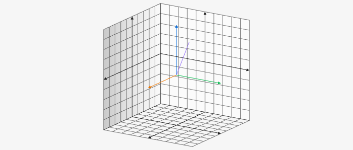

# Line3D

Line3D creates a line on the 3D board which takes two 3D points for the parameters. For example `[[x1, y1, z2], [x2, y2, z2]]`.

````yaml
```graph
bounds: [-10, 10, 10, -10]
bounds3d: [[-5,5], [-5,5], [-5,5]]
axis: false
keepAspectRatio: true
elements: [
	{type: line3d, def: [[0,0,0], [4,4,5]]}
]
```
````



