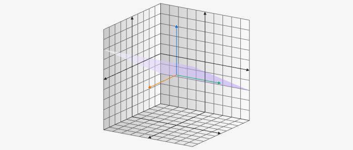

# Plane3D

Plane3D creates a plane on the 3D board it takes a starting 3D point and then takes two vectors of length 3 for the directions of the plane. For example `[[x, y, z], [x, y, z], [x, y, z]]`.

````yaml
```graph
bounds: [-10, 10, 10, -10]
bounds3d: [[-5,5],[-5,5],[-5,5]]
axis: false
keepAspectRatio: true
elements: [
	{type: plane3d, def: [[1,-1,1], [0,1,0], [2,1,1]]}
]
```
````



