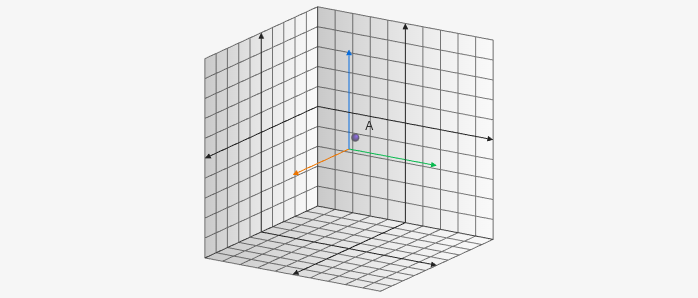

# Point3D

Point3D creates a point on the 3D board it takes an x, y, and z value for parameters. For example `[x, y, z]`.

````yaml
```graph
bounds: [-10, 10, 10, -10]
bounds3d: [[-5,5],[-5,5],[-5,5]]
axis: false
keepAspectRatio: true
elements: [
	{type: point3d, def: [1,1,1]}
]
```
````



