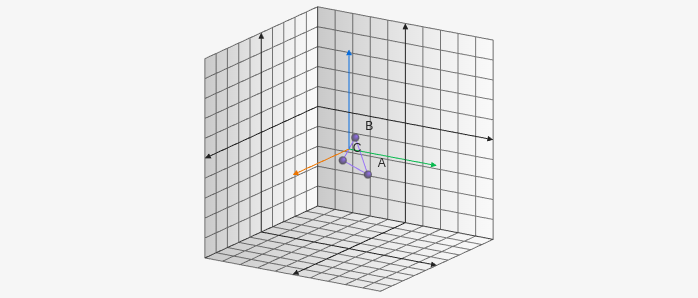

# Polygon3D

Polygon3D creates a polygon on the 3D board it takes an array of 3D points. For example `[[x1,y1,z1],[x2,y2,z2]]`.

````yaml
```graph
bounds: [-10, 10, 10, -10]
bounds3d: [[-5,5],[-5,5],[-5,5]]
axis: false
keepAspectRatio: true
elements: [
	{type: polygon3d, def: [[3,3,0], [1,1,1], [-1,-1,-1]]}
]
```
````



