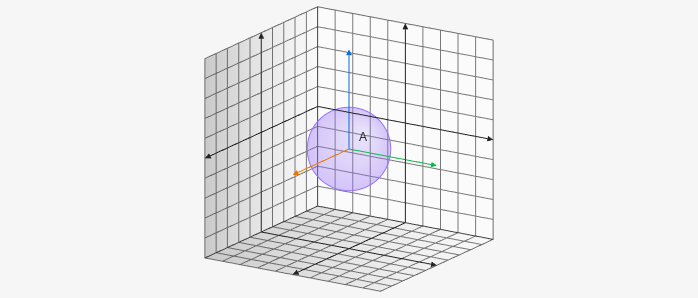

# Sphere3D

Sphere3D creates a sphere on the 3D board it takes a point 3D as the first parameter and then a number for the radius. For example `[[x,y,z], radius]`.

````yaml
```graph
bounds: [-10, 10, 10, -10]
bounds3d: [[-5,5], [-5,5], [-5,5]]
axis: false
keepAspectRatio: true
elements: [
	{type: sphere3d, def: [[0,0,0], 2]},
]
```
````



