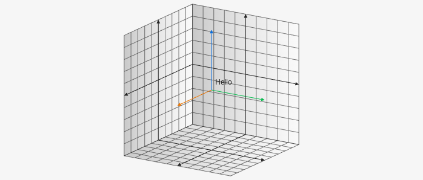

# Text3D

Creates a text object in the 3d space. Takes an array with the x,y, and z values and then the text you want to display `[x, y, z, "string"]`.

````yaml
```graph
bounds: [-10, 10, 10, -10]
bounds3d: [[-5,5], [-5,5], [-5,5]]
axis: false
keepAspectRatio: true
elements: [
	{type: text3d, def: [1, 1, 1, "Hello"]},
]
```
````

