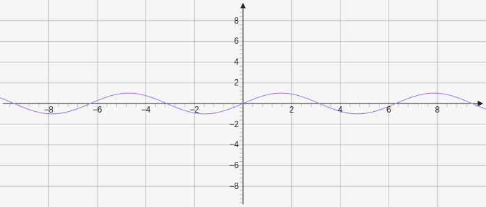
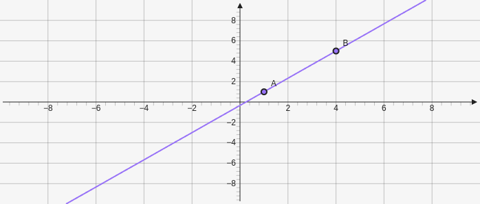

# Home

Obsidian Graphs is controlled through using a code block with the "graph" language. It the takes YAML to create a graph and add elements to the graph. The underlying graphing library being used is JSXGraph so if there is something that you are looking for that is not in this documentation go to [JSXGraph Docs](https://jsxgraph.org/wp/docs/index.html). There are some features in the JSXGraph Docs that are not implented in this plugin.

## Bounds

The bounds controls the dimensions of the graph it is defined through four numbers in an array `[xMin, yMax, xMax, yMin]`.

````yaml
```graph
bounds: [-10, 10, 10, -10]
```
````

* [More ways to customize the board of the graph](Board)

## Elements

### Creating Elements

To create elements you need to make an elements array `elements: []`. Within that array you can add elements the full list is [here](Elements).

There are three fields to fill out:

1. Type
	* `type: name`
	*  a string with the name of the element you are creating in all lower case and no spaces
2.  Definition 
	* `def: []`
	*  an array that contains the defining parameters of the element this can be a number, another element, an array of numbers, a string, or a function
1. Attribute
	* `att: {}`
        * this is an optional field
	* an object that contains attributes which modify features of elements
		* name
		* inverse
		* chartStyle
		* fillColor
		* strokeColor
		* fillOpacity
		* [full list of attributes](Attributes)
		
#### Creating Functions

To make a function as a parameter you need to make a string such as `"f:"` after the f: you can use math operators and functions supported by [JS Math](https://developer.mozilla.org/en-US/docs/Web/JavaScript/Reference/Global_Objects/Math). 

For variables there are by default `x`, `y`, and `z` defined in that order but they may not be used based on the element that they are being used on. You can change the name of the variable by doing `f(a,b,c):`.  You can define up to three variables. What the variables represent may change based on the element they are used on but in most cases it is the x, y, and z axes.

Math Operators
* \+
	* addition
* \-
	* subtraction
*  \*
	* multiplication
* \
	* division
* \*\*
	* exponent

For more complex math functions use the [Javascript math functions](https://developer.mozilla.org/en-US/docs/Web/JavaScript/Reference/Global_Objects/Math). __You do not need to put `Math.` before using a Math function__

Some examples:
* `PI`
* `abs()`
* `exp()`
* `sin()`
* `cos()`
* `pow()`

````yaml
```graph
bounds: [-10, 10, 10, -10]
elements: [
	{type: functiongraph, def: ["f:sin(x)"]}
]
```
````



#### Composing Elements
Elements can be composed to make other elements if an elements takes a point or line as a parameter then you can give it an already existing one. The element given as a parameter has to be defined before where it is being used and is accessed by passing in the index number starting at 0 for the element as a string with an e before it `"e0"`.

For example a line requires two points to be created so we can create two points before the line and then pass in the points as parameters.

````yaml
```graph
bounds: [-10, 10, 10, -10]
elements: [
	{type: point, def: [1,1]},
	{type: point, def: [4,5]},
	{type: line, def: ["e0", "e1"]}
]
```
````



